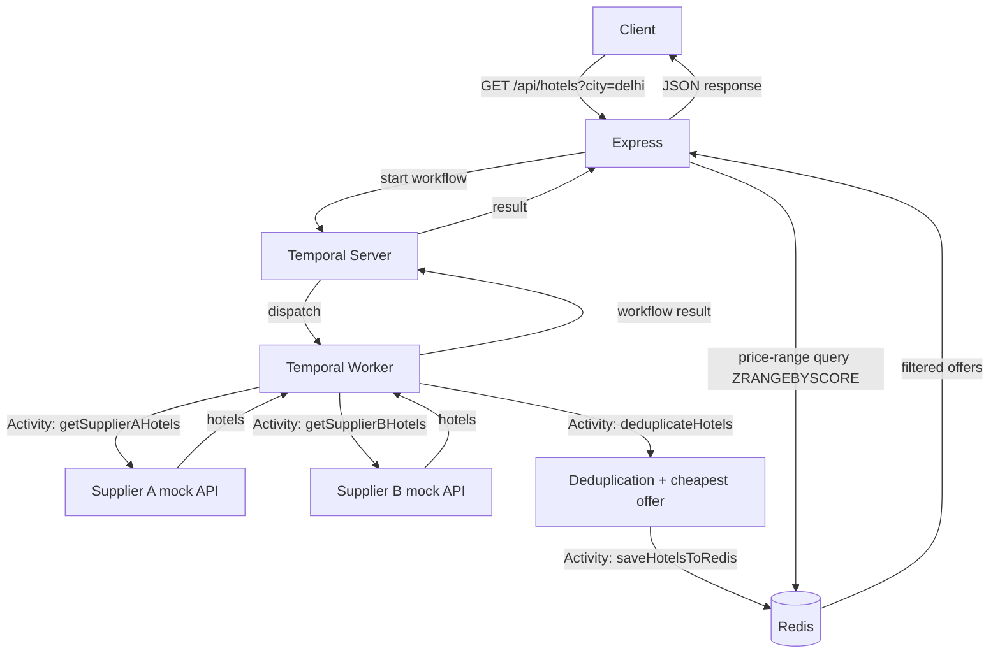

# Hotel Offer Orchestrator

A backend service that orchestrates two mocked hotel suppliers through a **Temporal** workflow, deduplicates and
price-compares their offers, persists the result in **Redis** using a data model that supports native numeric
range queries, and exposes it through an **Express** API.

## 1. Project Overview

`GET /api/hotels?city=delhi` triggers a Temporal workflow that:

1. Calls **Supplier A** and **Supplier B** mock APIs **in parallel** (as Temporal Activities).
2. Deduplicates the combined hotel list **by name**. When a hotel exists on both suppliers, the **cheaper** offer
   wins; ties are broken deterministically in favor of **Supplier A**.
3. Persists the deduplicated offers into **Redis**, using a Sorted Set keyed by price so later price-range queries
   (`minPrice`/`maxPrice`) are served by Redis itself — never by filtering an array in JavaScript.
4. Returns the (optionally filtered) list to the caller.

The same Express process also hosts two mock supplier endpoints (`/supplierA/hotels`, `/supplierB/hotels`) and a
`/health` endpoint that reports the status of the app, Redis, Temporal, and both suppliers.

## 2. Architecture



Key rule: **Express never talks to suppliers directly, and Temporal workflow code never performs I/O directly.**
All network/Redis calls live in Activities, executed by the Temporal Worker process.

## 3. Technology Stack

- Node.js 20 + TypeScript (strict mode)
- Express.js — HTTP API layer
- Temporal.io (`@temporalio/client|worker|workflow|activity`) — orchestration
- Redis (`ioredis`) — persistence + price-range filtering
- Docker / Docker Compose — full local runtime (Postgres backs Temporal's persistence layer)
- Pino — structured logging
- Jest + Supertest + ioredis-mock — automated tests
- Postman — API test collection

## 4. Project Structure

```
src/
├── api/
│   ├── routes/            # hotel, supplier, health routes
│   ├── controllers/       # thin HTTP handlers, no business logic
│   └── middleware/        # request validation + centralized error handling
├── temporal/
│   ├── client.ts           # Express -> Temporal client (starts/awaits workflow)
│   ├── worker.ts           # Temporal Worker process entrypoint
│   ├── workflows/          # hotelOfferWorkflow (deterministic orchestration only)
│   └── activities/         # supplier calls, deduplication, Redis save (all I/O)
├── redis/
│   ├── client.ts           # ioredis connection + health ping
│   ├── hotel.repository.ts # sorted-set persistence + ZRANGEBYSCORE filtering
│   └── redis.keys.ts       # key-naming helpers, documents the data model
├── suppliers/               # static mock catalogues for Supplier A / B
├── services/hotel.service.ts # cache-or-run-workflow orchestration used by the controller
├── types/hotel.types.ts     # shared TypeScript interfaces
├── config/                  # env.ts (typed env vars), logger.ts (pino)
├── app.ts                   # Express app wiring
└── server.ts                # HTTP server entrypoint (API process)
tests/
├── unit/                    # deduplication, validation, Redis repository (ioredis-mock)
└── integration/              # supertest against the Express app
postman/                      # Postman collection
```

The API process (`server.ts`) and the Temporal Worker (`worker.ts`) are **two separate Node processes** — this
mirrors a real production deployment where the API tier and the workflow-execution tier scale independently. Both
are built from the same Docker image, started with different commands in `docker-compose.yml`.

## 5. Running Locally (without Docker)

Requires a local Redis and a local Temporal server (e.g. `temporal server start-dev`, part of the
[Temporal CLI](https://docs.temporal.io/cli)).

```bash
npm install
cp .env.example .env   # edit REDIS_HOST/TEMPORAL_ADDRESS to localhost if not using Docker
npm run build
npm run dev             # runs API + Worker together (ts-node-dev, auto-reload)
```

`npm run dev` starts both the Express API and the Temporal Worker concurrently. Individual processes:

```bash
npm run dev:api
npm run dev:worker
```

## 6. Running with Docker (recommended)

Everything — Redis, Temporal (+ Postgres persistence + Web UI), the API, and the Worker — runs via Compose:

```bash
docker compose up --build -d
```

Once healthy:

- API: `http://localhost:3000`
- Temporal Web UI: `http://localhost:8080`
- Redis: `localhost:6379`

The multi-stage `Dockerfile` builds the API and worker using Node 20 on Debian slim,
which supplies the glibc required by Temporal's native worker library. Compose mounts
the included `temporal-dynamicconfig.yaml` for Temporal's default dynamic settings.

If another project already uses ports 3000, 6379, or 7233, use the included local
override (Docker Compose 2.24.4 or later):

```bash
docker compose -f docker-compose.yml -f docker-compose.local.yml up --build -d
```

This serves the API at `http://localhost:3001`, keeps Redis and Temporal accessible
inside Docker, and serves Temporal Web UI at `http://localhost:8080`. This is the
configuration currently running on this machine. Use port 3001 for the examples below
when running with this override.

Inspect status and logs:

```bash
docker compose ps
docker compose logs -f app worker
```

Try it:

```bash
curl "http://localhost:3000/api/hotels?city=delhi"
curl "http://localhost:3000/api/hotels?city=delhi&minPrice=5000&maxPrice=7000"
curl "http://localhost:3000/health"
```

Stop everything:

```bash
docker compose down          # keep the Postgres/Temporal volume
docker compose down -v       # also remove the volume (full reset)
```

If using the local override, stop with
`docker compose -f docker-compose.yml -f docker-compose.local.yml down`.

## 7. API Documentation

### `GET /api/hotels`

| Query param | Required | Notes |
|---|---|---|
| `city` | yes | Non-empty string. Case-insensitive. |
| `minPrice` | no | Non-negative number. |
| `maxPrice` | no | Non-negative number. Must be `>= minPrice` if both given. |

Success — `200 OK`:

```json
[
  { "name": "Holtin", "price": 5340, "supplier": "Supplier B", "commissionPct": 20 },
  { "name": "Radison", "price": 5900, "supplier": "Supplier A", "commissionPct": 13 }
]
```

Validation error — `400 Bad Request`:

```json
{ "error": "Bad Request", "message": "Query parameter \"city\" is required" }
```

### `GET /supplierA/hotels?city=<city>` / `GET /supplierB/hotels?city=<city>`

Mock supplier endpoints. Return the raw supplier catalogue for the given city (`[]` if unknown). Backing data
covers `delhi`, `mumbai`, `bangalore`, with intentional overlaps, supplier-exclusive hotels, and one equal-price
tie (`Radison` in Delhi) to exercise the tie-break rule.

### `POST /supplierA/toggle-down` / `POST /supplierB/toggle-down`

Testing/demo helper — body `{ "down": true }` makes that supplier's `/hotels` endpoint return `503` (and show as
`"down"` in `/health`) until toggled back with `{ "down": false }`. Lets you exercise the "one supplier is down"
resilience path end-to-end without running the suppliers as separate services: toggle Supplier A down, call
`GET /api/hotels?city=<an-uncached-city>`, and the response still comes back `200` with Supplier B's offers only.
See Postman requests 13–16.

### `GET /health`

```json
{
  "status": "healthy",
  "services": { "redis": "healthy", "temporal": "healthy", "supplierA": "healthy", "supplierB": "healthy" }
}
```

Returns `200` when every dependency is healthy, `503` with `status: "degraded"` otherwise (per-dependency detail
still included).

## 8. Redis Data Model

Per city, two key types work together:

```
hotel:offers:{city}            Sorted Set   member = slugified hotel name, score = price
hotel:offer:{city}:{hotelKey}  String (JSON)  the full HotelOffer object
```

Example after saving Delhi's deduplicated offers:

```
ZADD hotel:offers:delhi 5340 holtin
ZADD hotel:offers:delhi 5900 radison
ZADD hotel:offers:delhi 7200 taj-palace

SET  hotel:offer:delhi:holtin      '{"name":"Holtin","price":5340,"supplier":"Supplier B","commissionPct":20}'
SET  hotel:offer:delhi:radison     '{"name":"Radison","price":5900,"supplier":"Supplier A","commissionPct":13}'
SET  hotel:offer:delhi:taj-palace  '{"name":"Taj Palace","price":7200,"supplier":"Supplier B","commissionPct":15}'
```

**Price filtering is done entirely by Redis**, using `ZRANGEBYSCORE hotel:offers:delhi <min> <max>` (default
`-inf`/`+inf` when a bound is omitted) to get the matching hotel keys in price order, then `MGET` to fetch their
full JSON objects. This is implemented in [`src/redis/hotel.repository.ts`](src/redis/hotel.repository.ts) —
there is no `.filter()` call anywhere in that path; the range query is what narrows the result set.

Both key types share the same TTL (`REDIS_TTL_SECONDS`, default `3600`) applied on write, so a city's cached
result expires as a unit. Re-saving a city (e.g. on cache expiry) first deletes the previous sorted-set members
and their detail keys before writing the new set, so stale hotel entries never linger.

## 9. Cache Strategy

- On a request, [`hotel.service.ts`](src/services/hotel.service.ts) checks whether `hotel:offers:{city}` already
  exists in Redis (`EXISTS`).
  - **Miss** → start the Temporal workflow (suppliers → dedupe → save to Redis), then read the result back from
    Redis.
  - **Hit** → skip Temporal entirely and read straight from Redis.
- Either way, the final response — including price filtering — is always produced by the Redis range query, so
  behavior is identical regardless of whether the workflow ran on this request.
- TTL is configurable via `REDIS_TTL_SECONDS`. A city with **zero** matching hotels is not cached (there is
  nothing to store), so it will re-run the workflow on every request — harmless here since it's a fast in-memory
  mock, but noted as a deliberate simplification.

## 10. Temporal Workflow

**Workflow:** [`hotelOfferWorkflow`](src/temporal/workflows/hotel.workflow.ts) — deterministic orchestration only.
No network calls, no Redis calls, no `Date.now()`/`Math.random()` inside the workflow body.

**Activities** (all I/O, in [`src/temporal/activities/`](src/temporal/activities)):

| Activity | Responsibility |
|---|---|
| `getSupplierAHotels(city)` | HTTP GET to Supplier A, tags results with `supplier: 'Supplier A'` |
| `getSupplierBHotels(city)` | HTTP GET to Supplier B, tags results with `supplier: 'Supplier B'` |
| `deduplicateHotels(a, b)` | Combines both lists, groups by hotel name, keeps the cheaper offer |
| `saveHotelsToRedis(city, offers)` | Persists the final list via the Redis repository |

Execution flow:

```ts
const [supplierAResult, supplierBResult] = await Promise.allSettled([
  getSupplierAHotels(city),
  getSupplierBHotels(city),
]);
// ... resilience handling (see below) ...
const offers = await deduplicateHotels(supplierAHotels, supplierBHotels);
await saveHotelsToRedis(city, offers);
```

`Promise.allSettled` inside the workflow guarantees Supplier A and Supplier B activities are **dispatched
concurrently** and the workflow doesn't fail outright if one of them ultimately fails.

**Retries:** supplier and Redis-save activities use `maximumAttempts: 3` with exponential backoff
(`initialInterval: 500ms`, `backoffCoefficient: 2`); the pure-CPU `deduplicateHotels` activity uses a lighter
`maximumAttempts: 2` since it has no external dependency to retry against.

## 11. Error Handling

| Case | Behavior |
|---|---|
| Missing/blank `city` | `400 Bad Request`, structured JSON body |
| Non-numeric `minPrice`/`maxPrice` | `400 Bad Request` |
| `minPrice > maxPrice` | `400 Bad Request` |
| Negative price value | `400 Bad Request` |
| One supplier fails (even after activity retries) | **Resilient**: the workflow logs the failure (`Supplier failure` / workflow-level error log) and proceeds with the healthy supplier's offers. The request still succeeds with a partial (but valid) result. |
| Both suppliers fail | Workflow returns an empty offer list rather than throwing, since a partial/empty result is still a valid response for "no data available right now"; the failures are logged with full context. |
| Redis save fails | Activity throws (retried per policy); if still failing after retries, the workflow — and therefore the HTTP request — fails with a `500`, since we cannot guarantee price-range filtering without persisted data. |
| Unknown route | `404 Not Found` |
| Uncaught error | Centralized `errorMiddleware` returns `500 Internal Server Error`, logs full context server-side, never leaks internals to the client |

This resilience choice (serve the healthy supplier rather than fail the whole request) was made because a partial
hotel list is more useful to an end user than a hard error, and it's clearly signalled via logs
(`Supplier A failed after retries, continuing with remaining supplier(s)`).

## 12. Testing

```bash
npm test                 # all tests
npm run test:unit        # deduplication, validation, Redis repository (ioredis-mock, no real Redis needed)
npm run test:integration # supertest against the Express app (supplier mocks, validation, 404s)
```

Covered scenarios:
- Deduplication: cheaper offer wins, hotel unique to Supplier A retained, hotel unique to Supplier B retained,
  deterministic tie-break (equal price → Supplier A), case/whitespace-insensitive name matching, price-ascending
  sort.
- Price filtering (via `ioredis-mock`, exercising the real `ZRANGEBYSCORE` + `MGET` path): `minPrice` only,
  `maxPrice` only, both, no filter, no matches, cache overwrite on re-save.
- Validation: missing city, non-numeric price, negative price, `minPrice > maxPrice`, valid combinations.
- Integration: mock supplier endpoints return data/empty arrays, 400s on bad `/api/hotels` queries, 404 on
  unknown routes.

Business logic (deduplication, validation, Redis repository) is tested without requiring a running Docker stack.
Full end-to-end behavior (Temporal workflow execution, supplier failure resilience) is best verified via
`docker compose up --build` and the Postman collection, since it requires a live Temporal server.

## 13. Postman

Import [`postman/hotel-offer-orchestrator.postman_collection.json`](postman/hotel-offer-orchestrator.postman_collection.json)
into Postman. It defines a `baseUrl` collection variable (default `http://localhost:3000`) and covers: Delhi
hotels, price range (`both`/`min-only`/`max-only`), unknown city, health check, missing city (400), invalid price
(400), negative price (400), invalid range (400), and both raw supplier endpoints. Run the whole collection with
the Collection Runner, or via `newman run postman/hotel-offer-orchestrator.postman_collection.json` once the stack
is up.

## 14. Design Decisions

- **Separate API and Worker processes.** Keeps HTTP concerns and workflow execution independently scalable/
  deployable, matching how Temporal is used in production, and keeps `worker.ts` a pure Temporal Worker rather
  than a special case bolted onto the Express process.
- **Activities return/throw, workflow catches with `Promise.allSettled`.** Lets Temporal's own retry policy
  govern each supplier call (so `Supplier failure` retries are real Temporal retries, inspectable in the Web UI),
  while keeping the workflow itself resilient to a single supplier failing outright.
- **`deduplicateHotels` as its own Activity**, even though it's pure CPU logic with no I/O. Chosen to match the
  required architecture (comparison/deduplication as a distinct orchestration step, visible in Temporal's event
  history) and to keep the workflow body a thin, readable sequence of steps.
- **Redis Sorted Set + companion JSON string, not a single blob.** A single JSON blob per city would force
  application-side filtering after a `GET`, which the requirements explicitly forbid. The sorted set makes price
  range queries native to Redis (`ZRANGEBYSCORE`), while the companion key keeps the full object retrieval a
  simple `MGET` — no secondary index or Lua script needed.
- **Cache-first via `EXISTS` on the sorted set.** Cheap existence check avoids re-running the workflow (and thus
  re-hitting both suppliers) for hot cities within the TTL window, while every read — cached or fresh — always
  goes through the same Redis range-query code path, so behavior is consistent.
- **Postgres-backed Temporal (`auto-setup` image), not an in-memory dev server.** More representative of a real
  deployment and keeps workflow history durable across container restarts within a `docker compose` session.
